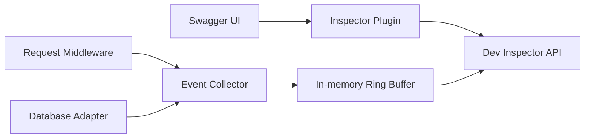

# Architecture Proposal

This document describes the intended architecture. It is not an implementation specification yet.

## High-level flow



## Package responsibilities

### `core`

Framework-neutral building blocks:

- Request event and query event schemas.
- Request correlation IDs.
- SQL normalization and query fingerprints.
- In-memory ring-buffer storage.
- Aggregation by route, query fingerprint, and time window.
- Redaction and sampling policies.
- Threshold evaluation for slow requests and queries.

### `adapters/django_ninja`

- Django request lifecycle integration.
- Django Ninja route metadata.
- Django database query capture.
- Django settings-based enablement.
- Registration of Inspector endpoints alongside the existing Ninja API.

### `adapters/fastapi`

- ASGI middleware integration.
- FastAPI route metadata.
- SQLAlchemy and DB-API integration points where available.
- FastAPI settings-based enablement.
- Registration of Inspector endpoints on the same application.

### `swagger_ui_plugin`

- Inspector tab or navigation affordance.
- Request list and request detail views.
- Query table, timing summary, and aggregate views.
- Loading, empty, and disabled states.
- Compatibility layer for the supported Swagger UI minor version.

## Event model proposal

Every captured request should be associated with a compact event:

```text
RequestEvent
├── request_id
├── timestamp
├── framework
├── method
├── route_template
├── status_code
├── duration_ms
├── query_count
├── query_time_ms
└── queries[]
    ├── fingerprint
    ├── statement
    ├── duration_ms
    ├── database
    └── stack_hint (optional)
```

## Storage strategy

The default store should be process-local and bounded:

- Keep only the most recent N request events.
- Evict old events automatically.
- Avoid a migration or external database for the basic experience.
- Offer a future store interface for Redis, files, or OpenTelemetry export.

## Security and privacy defaults

- Disabled unless explicitly enabled in development.
- Never expose the Inspector publicly by default.
- Redact query parameters and authorization headers.
- Do not capture request or response bodies by default.
- Limit statement length and event count.
- Provide an authentication hook for shared development environments.

## Swagger integration boundary

The project should integrate through Swagger UI's plugin and layout APIs. It should not fork Swagger UI or modify its core source. The supported Swagger UI minor version should be pinned and tested because custom plugins may rely on internal component APIs.

